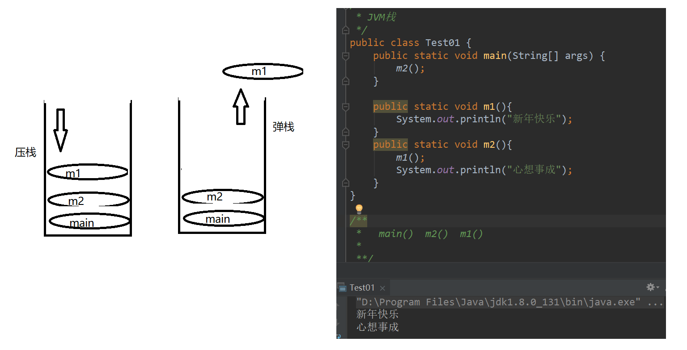
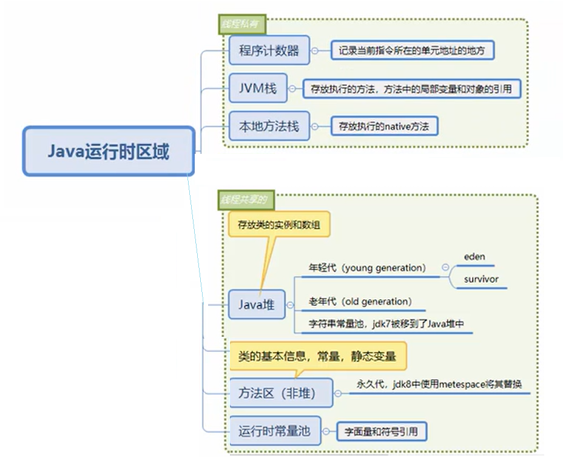
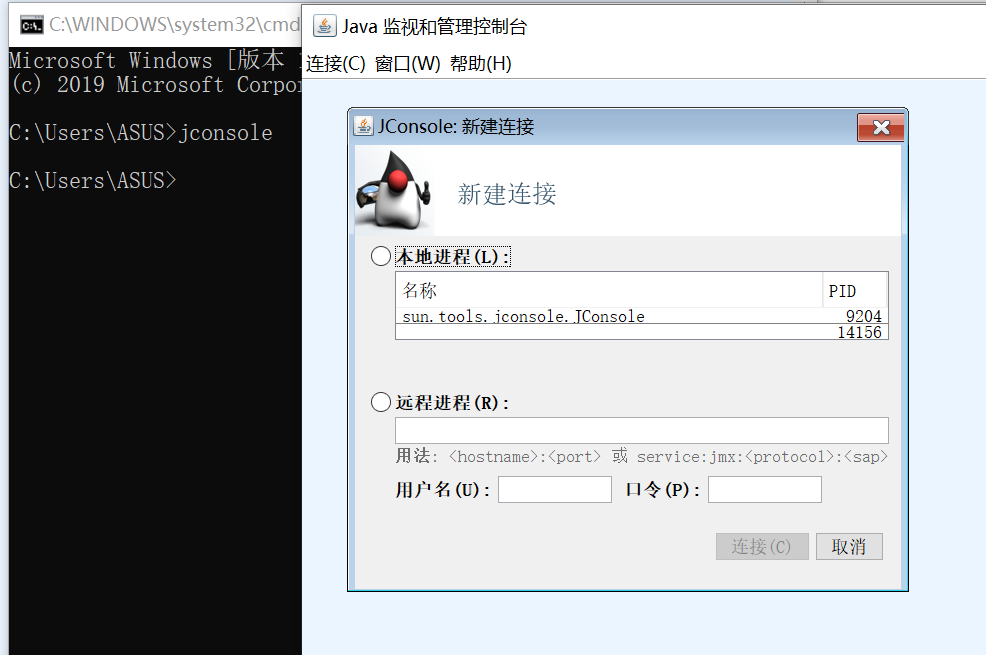
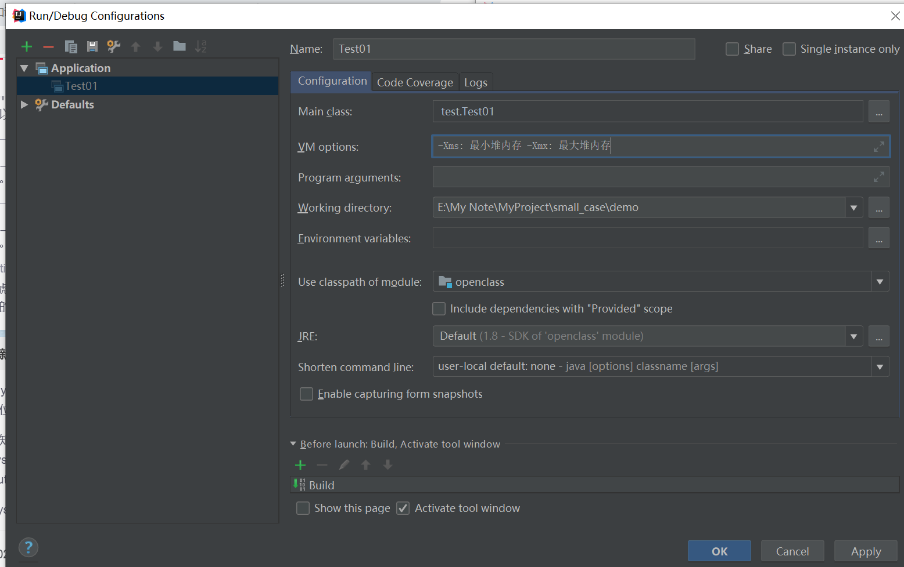
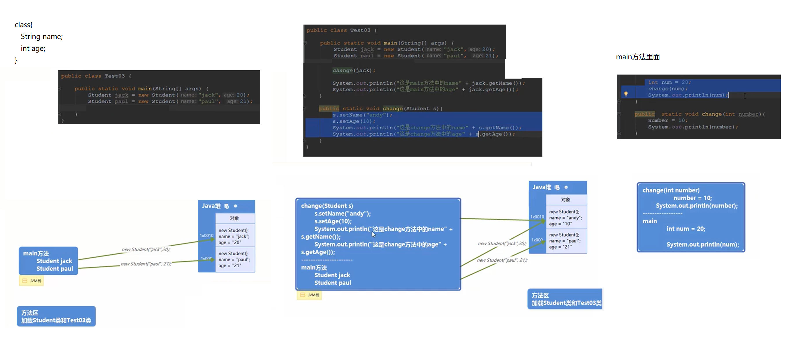

# small_case

[TOC]

视频：[Java基础+web知识点综合应用教程合集](https://www.bilibili.com/video/BV1DW411g78o)

## Java 运行时的区域

### 程序计数器
记录当前指令所在的单元地址的地方

每个线程有自己的程序计数器，如果两个线程访问同一个计数器就出问题了。==程序计数器类似书签==

记录程序的行号

### JVM栈

栈的数据结构

可以看作是一个桶

==主要存放执行的方法，方法中的局部变量和对象的引用。==（对象引用指向对象）



### 本地方法栈

存放的是本地的方法

native关键字修饰的方法，不是java编写的方法。底层是C++或者是C语言写的。程序计数器不会记录native方法的行数，会使用undefined替代

比如Object类里，

```java
public class Object {

    private static native void registerNatives();
    static {
        registerNatives();
    }
    ...
}
```

### Java堆

存放类的实例和数组。==new出来的东西==

#### 年轻代 young generation
​	eden 被垃圾回收器频繁扫面
​	survivor eden中没被回收的东西

#### 老年代 old generation  

​    survivor中没被回收的东西

垃圾回收器会频繁扫描年轻代的垃圾，老年代存放的时间更长

#### 字符串常量池

在JDK7之后，字符串常量池被移到了Java堆

```java
String s1 = "happy";

字符串常量池放的是引用，即s1
而happy放在堆内存里面
    
String s2 = new String("happy");

会在堆内存里多创建一个空间
```


### 方法区

跟java里的方法没有关系。
存放类的基本信息，常量（final），静态变量 (static )。

又称为**非堆**
是Java堆逻辑的一部分，但是真正运行时是两部分

#### 永久代

不会被垃圾回收器回收，在JDK8中使用metespace将其替换


### 运行时常量池

跟字符串常量池不是一回事

存放字面量和符号引用

```java
int a = 10;  //10是字面量
```

符号引用：告诉当前的类所应用的类内存地址在哪里

```java
public class Test01 {
   
   ...
       
    public static void m1(){
        int a = 10;
        Object b = new Object();
       
        List<String> list = new ArrayList<>(); //java.util.List
        System.out.println("新年快乐");
    }
    
    ...

}

```


程序计数器，JVM栈，本地方法区 是线程私有的。不会发生线程安全问题。

Java堆，方法区，运行时常量池是线程共享的。会发送安全问题。

会发生OutOfMemoryError异常的区域：除了程序计数器
StackOverflowError 区域：运行时常量池，方法区，JVM堆，本地方法栈。除了程序计数器，JVM栈



监测java运行的内存




可以给java程序分配堆内存

Edit Configurations






> num和number是jvm堆中的两段内存空间里的对东西


## 案例

[使用二维数组实现酒店房间管理系统](https://github.com/GRuiQi/small_case/tree/main/demo/array_test)

[模拟软件使用次数](https://github.com/GRuiQi/small_case/tree/main/demo/tryuse)

[扑克牌的洗牌和发牌](https://github.com/GRuiQi/small_case/tree/main/demo/04_playingCards)

[多线程模拟多级公司售卖电影票](https://github.com/GRuiQi/small_case/tree/main/demo/ThreadTest/src)

[基于web双色球随机生成](https://github.com/GRuiQi/small_case/tree/main/dcb)

[基于web的购物车](https://github.com/GRuiQi/small_case/tree/main/shopping_card)

[web踢出在线用户](https://github.com/GRuiQi/small_case/tree/main/web_manager)

[jdbc、数据库连接池](https://github.com/GRuiQi/small_case/tree/main/connection_pool)

[使用ajax校验用户名是否存在](https://github.com/GRuiQi/small_case/tree/main/online_user)

[filter的使用案例](https://github.com/GRuiQi/small_case/tree/main/TestFilter)
解决软乱码问题
控制权限访问
过滤非法ip
计算请求响应的耗时